# PhoneNow Call Center Customer Retention: Customer demographics, Services and Insights.

## INTRODUCTION
A few weeks after presenting the Customer Satisfaction and Agent Behavior dashboard to the management, the Retention Manager from the telecom reached out to me directly. She was impressed by the work and asked if I can put together a dashboard about customer retention.
This is the second task in the Virtual case experience with PwC. I’ll be reporting to the retention manager of PwC about customer retention in PhoneNow.
Refer to PwC Switzerland Power BI Virtual Case Experience Task 1 [here](https://github.com/PsycheXAnalyst/PwC-Power-BI-Virtual-Case-Experience-Project)

## PROBLEM STATEMENT
The Retention department in the telecom company, PhoneNow, is concerned about losing their customers and also getting back churned customers. The customers are of priority to them as customers in the telecom industry are hard-earned.
The project was done based on the request of the Retention Manager. The engagement partner, requested for the following tasks to be done:

1. Define proper KPIs
2. Create a dashboard for the retention manager reflecting the KPIs
3. Write a short email to him (the engagement partner) explaining my findings, and include suggestions as to what needs to be changed.

### Objectives
After a meeting with the Retention Manager, I was provided with the following inputs
• Customers who left within the last month
• Services each customer has signed up for: phone, multiple lines, internet, online security, online backup, device protection, tech 
support, and streaming TV and movies
• Customer account information: how long as a customer, contract, payment method, paperless billing, monthly charges, total charges 
and number of tickets opened in the categories administrative and technical
• Demographic info about customers – gender, age range, and if they have partners and dependents

## SKILL DEMONSTRATED
The tool used for the analysis was Microsoft Power BI. The Power BI concepts that were used include;
- DAX (Data Analysis Expression) Concept for Calculated Measures.
- Power Query Editor for data cleaning (Conditional Columns and Added Columns)
- Data Visualization 

## DATA SOURCING
The Retention department manager provided the dataset used for the analysis.
As a data analyst, I took the time to carefully understand the dataset and planned how to best approach the data cleaning, transformation and analysis process without excluding key features.

### Data Structure
The dataset is structured in the Microsoft Excel workbook (.xlsx) file format. It contains 7,043 rows/entries and 23 columns , namely:
Churn: It contains the status of the customers; churned or retained.
Customer_ID: It contains the identity representation of customers 
Contract: It contains the type of contract the customer runs 
Dependent: It contains data of customers who have partners.
Device_Protection: It contains data of customers who have device protection.
Gender: It contains the gender of the customers. 
Internet_Service: It contains data of customers who have internet service.
Monthly_Charges: It contains the monthly charges paid by customers.
Multiple_Lines: It contains data of customers who have multiple lines.
Num_Admin_Ticket: The number of Admin tickets.
Num_Tech_Ticket: The number of Tech tickets 
Online_Backup: It contains data of customers who have online backup.
Online_Security: It contains data of customers who have online security.
Paperless_Billing: It contains data of customers who use paperless billing.
Partner: It contains data of customers who have partners.
Payment_Method: It contains payment method used by the customers.
Phone_Service: It contains data of customers who have phone service.
Senior_Citizen:It contains data of customers who are senior citizens.
Streaming_Movies: It contains data of customers who stream movies.
Streaming_TV: It contains data of customers who stream TV.
Tech_Support: It contains data of customers who have tech support.
Tenure: It contains how long the customers has joined the company.
Total_Charges: It contains the total amount customers paid for service.

## DATA TRANSFORMATION
Before diving into any analysis, the datasets was imported into Power Query on Microsoft Power BI.
The following transformations were done:
1. Removal of errors and duplicates present in the data for each table and column.
2. Check for blank cells or missing values in the dataset.
3. Correction of data types, especially suration/Tenure.
4. Added conditional columns to group the monthly charges and Total charges by customers.
5. Added a column to group the tenure in years after dividing the tenure (month) by 12.

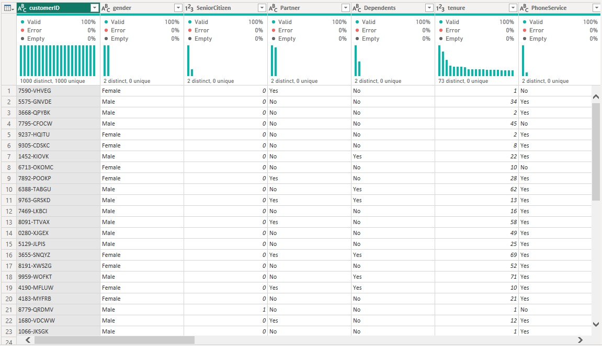

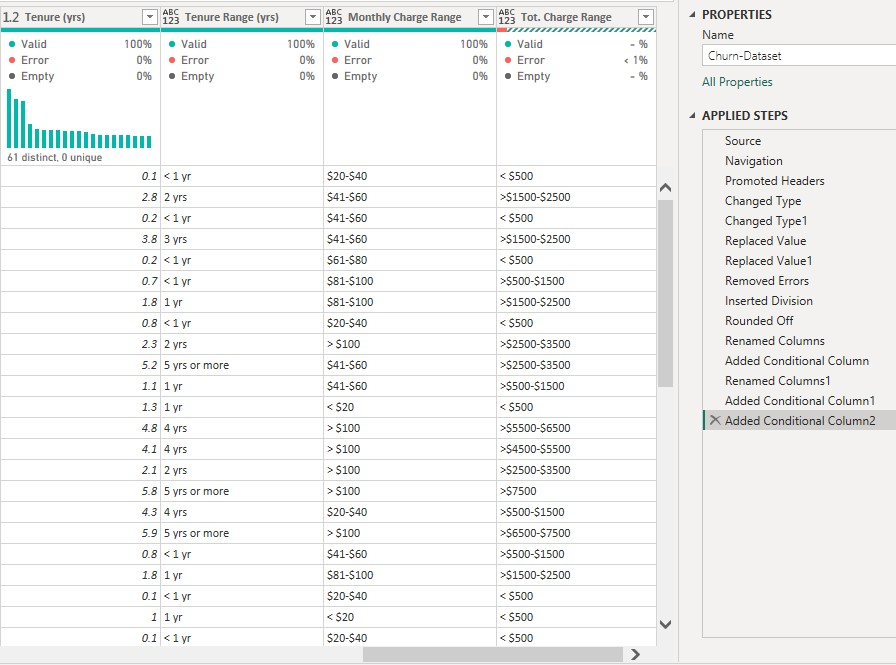

## MODELLING
The dataset contains only one table, there was no modeling done.

## ANALYSIS AND VISUALIZATIONS

In this step, I carried out an exploratory analysis of the data to answer the objectives and questions that were stated earlier.
First of all, I did a quick summary by calculating some important measures using DAX.

### Objective One

Customers who left within the last month

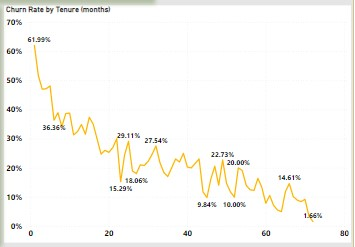

### Objective Two 

Services each customer has signed up for: 
Distribution of Customers (Churned and Retained) by phone service.

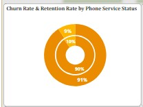

Distribution of Customers (Churned and Retained) by multiple lines.

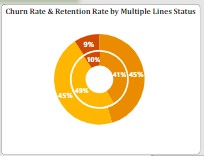

Distribution of Customers (Churned and Retained) by internet.

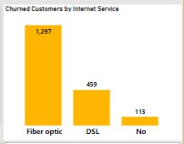

Distribution of Customers (Churned and Retained) by online security and online backup.

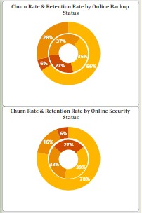

Distribution of Customers (Churned and Retained) by device protection and tech support.

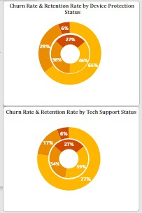

Distribution of Customers (Churned and Retained) streaming TV and movies

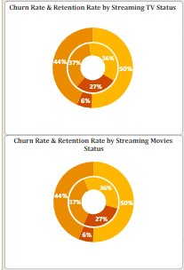

### Objective Three

• Customer account information
How long does customers (Churned and Retained) stay based on contract. 

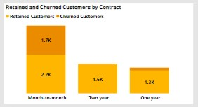

Distribution of Customers (Churned and Retained) by payment method.

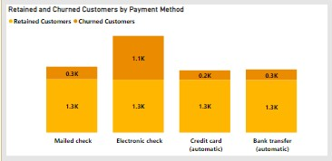

Distribution of Customers (Churned and Retained) by paperless billing.

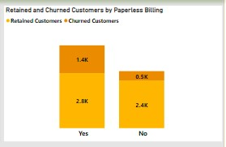

Average Monthly charges and Total charges.

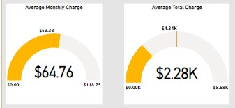

Distribution of Customers (Churned and Retained) by Monthly and Total Charges.

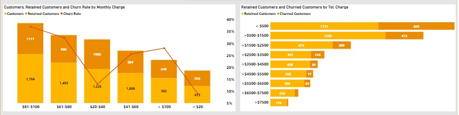

### Objective Four 
Distribution of Churned Customers by Demographic information - gender, age range, and if they have partners and dependents.

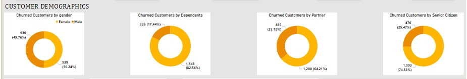

Here is the summary and insightful dashboard built from the data analysis.

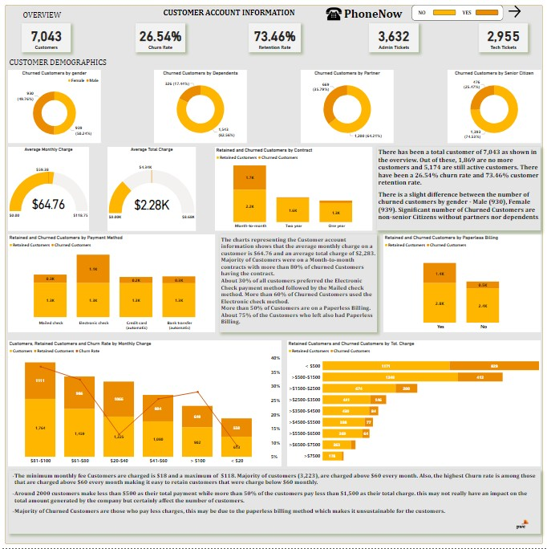

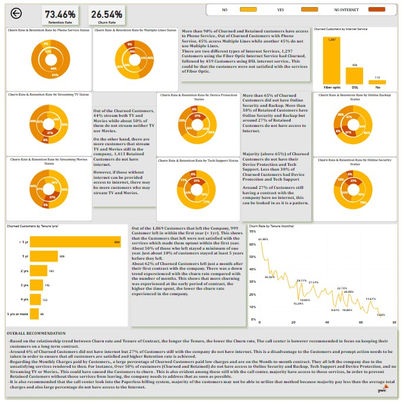

INSIGHTS
- There has been a total customer of 7,043 as shown in the overview. Out of these, 1,869 are no more customers and 5,174 are still active customers. There has been a 26.54% churn rate and 73.46% customer retention rate.
- There is a slight difference between the number of churned customers by gender - Male (930), Female (939). Significant number of Churned Customers are non-senior Citizens without partners or dependents
- The chart representing the Customer account information shows that the average monthly charge on a customer is $64.76 and an average total charge of $2,283. Most Customers were on a Month-to-month contract with more than 80% of churned Customers having a contract.
- About 30% of all customers preferred the Electronic Check payment method followed by the Mailed check method. More than 60% of Churned Customers used the Electronic check method.
- More than 50% of Customers are on a Paperless Billing. About 75% of the Customers who left also had Paperless Billing.
- The minimum monthly fee Customers are charged is $18 and a maximum of $118. The majority of customers (3,223), are charged above $60 every month. Also, the highest Churn rate is among those that are charged above $60 every month making it easy to retain customers that were charged below $60 monthly.
- Around 2000 customers make less than $500 as their total payment while more than 50% of the customers pay less than $1,500 as their total charge. This may not really have an impact on the total amount generated by the company but certainly affect the number of customers.
- Majority of Churned Customers are those who pay less charges, this may be due to the paperless billing method which makes it unsustainable for the customers.
- More than 90% of Churned and Retained customers have access to Phone Service.. Out of Churned Customers with Phone Service, 45% access Multiple Lines while another 45% do not use Multiple Lines.
- There are two different types of Internet Services, 1,297 Customers using Fiber Optic Internet Service have Churned, followed by 459 Customers using DSL Internet service. This could be because the customers were not satisfied with the services of Fiber Optic.
- Out of the Churned Customers, 44% stream both TV and Movies while about 50% of them do not stream either TV or Movies.
- On the other hand, more customers still stream TV and Movies in the company. 1,413 Retained Customers do not have internet.
- More than 65% of Churned Customers did not have Online Security and Backup. More than 30% of Retained Customers have Online Security and Backup but around 27% of Retained Customers do not have access to the Internet.
- Majority (above 65%) of Churned Customers do not have their Device Protection and Tech Support. Less than 30% of Churned Customers had Device Protection and Tech Support
Around 27% of Customers still having a contract with the company have no internet, this can be looked into as it is a pattern
- Out of the 1,869 Customers that left the Company, 999 Customers left within the first year (< 1yr). This shows that the Customers that left were not satisfied with the services which made them opt out within the first year. About 50% of those who left stayed a minimum of one year. About 10% of customers stayed at least 5 years before leaving.
- About 62% of Churned Customers left just a month after their first contract with the company. There was a downtrend experienced with the churn rate compared with the number of months. This shows that more churning was experienced in the early period of the contract, the higher the time spent, the lower the churn rate experienced in the company.

## RECOMMENDATION 

Based on the relationship trend between Churn rate and Tenure of Contract, the longer the Tenure, the lower the Churn rate, The call center is however recommended to focus on keeping their customers on a long-term contract.
Around 6% of Churned Customers did not have internet but 27% of Customers still with the company do not have internet. This is a disadvantage to the Customers and prompt action needs to be taken in order to ensure that all customers are satisfied and a higher Retention rate is achieved.
Regarding the Monthly Charges paid by Customers, a large percentage of Churned Customers paid low charges and are on a Month-to-month contract. They all left the company due to the unsatisfying services rendered to them. For instance, Over 50% of customers (Churned and Retained) do not have access to Online Security and Backup, Tech Support and Device Protection, and no Streaming TV or Movies. This could have caused the Customers to churn. This is also evident among those still with the call center, the majority have access to those services. In order to prevent Retained Customers without those services from leaving, the company needs to address that as soon as possible.
It is also recommended that the call center look into the Paperless billing system. The majority of the customers may not be able to utilize that method because the majority pay less than the average total charges and also a large percentage do not have access to the Internet.
However, if those without internet access can be provided access to the internet, there may be more customers who may stream TV and Movies.

## CONCLUSION
The analysis has provided valuable insights that will help the Retention department as well as the Call Center better understand their customers and make informed decisions to improve customer retention and satisfaction.
It was an interesting experience working on this project. I hope you had as much fun as I did going through this documentation. Let me know what you think! **_Thank you!_**

_Your feedback is very important to me and my growth as a data analyst. Follow for more exciting data analysis projects from PsycheXAnalyst (Abdul-Afeez Adedeji)._
